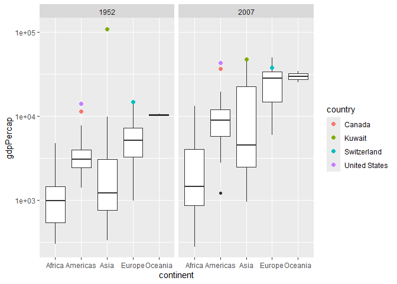
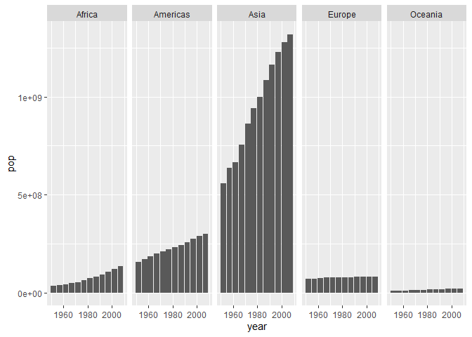
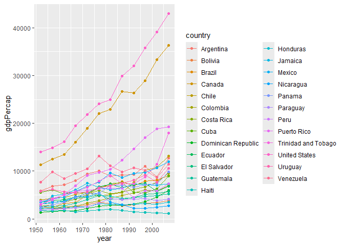
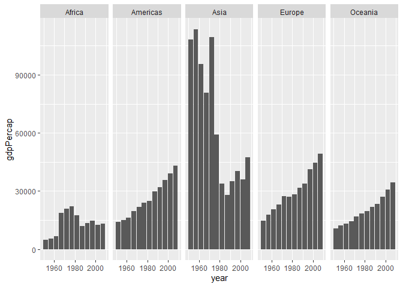
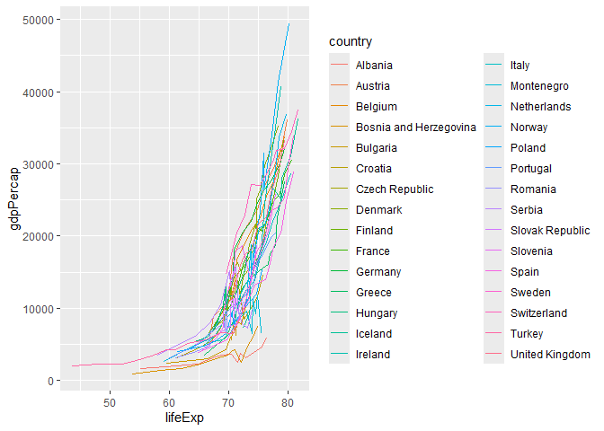

Gapminder
================
(Your name here)
2020-

- [Grading Rubric](#grading-rubric)
  - [Individual](#individual)
  - [Submission](#submission)
- [Guided EDA](#guided-eda)
  - [**q0** Perform your “first checks” on the dataset. What variables
    are in
    this](#q0-perform-your-first-checks-on-the-dataset-what-variables-are-in-this)
  - [**q1** Determine the most and least recent years in the `gapminder`
    dataset.](#q1-determine-the-most-and-least-recent-years-in-the-gapminder-dataset)
  - [**q2** Filter on years matching `year_min`, and make a plot of the
    GDP per capita against continent. Choose an appropriate `geom_` to
    visualize the data. What observations can you
    make?](#q2-filter-on-years-matching-year_min-and-make-a-plot-of-the-gdp-per-capita-against-continent-choose-an-appropriate-geom_-to-visualize-the-data-what-observations-can-you-make)
  - [**q3** You should have found *at least* three outliers in q2 (but
    possibly many more!). Identify those outliers (figure out which
    countries they
    are).](#q3-you-should-have-found-at-least-three-outliers-in-q2-but-possibly-many-more-identify-those-outliers-figure-out-which-countries-they-are)
  - [**q4** Create a plot similar to yours from q2 studying both
    `year_min` and `year_max`. Find a way to highlight the outliers from
    q3 on your plot *in a way that lets you identify which country is
    which*. Compare the patterns between `year_min` and
    `year_max`.](#q4-create-a-plot-similar-to-yours-from-q2-studying-both-year_min-and-year_max-find-a-way-to-highlight-the-outliers-from-q3-on-your-plot-in-a-way-that-lets-you-identify-which-country-is-which-compare-the-patterns-between-year_min-and-year_max)
- [Your Own EDA](#your-own-eda)
  - [**q5** Create *at least* three new figures below. With each figure,
    try to pose new questions about the
    data.](#q5-create-at-least-three-new-figures-below-with-each-figure-try-to-pose-new-questions-about-the-data)

*Purpose*: Learning to do EDA well takes practice! In this challenge
you’ll further practice EDA by first completing a guided exploration,
then by conducting your own investigation. This challenge will also give
you a chance to use the wide variety of visual tools we’ve been
learning.

<!-- include-rubric -->

# Grading Rubric

<!-- -------------------------------------------------- -->

Unlike exercises, **challenges will be graded**. The following rubrics
define how you will be graded, both on an individual and team basis.

## Individual

<!-- ------------------------- -->

| Category | Needs Improvement | Satisfactory |
|----|----|----|
| Effort | Some task **q**’s left unattempted | All task **q**’s attempted |
| Observed | Did not document observations, or observations incorrect | Documented correct observations based on analysis |
| Supported | Some observations not clearly supported by analysis | All observations clearly supported by analysis (table, graph, etc.) |
| Assessed | Observations include claims not supported by the data, or reflect a level of certainty not warranted by the data | Observations are appropriately qualified by the quality & relevance of the data and (in)conclusiveness of the support |
| Specified | Uses the phrase “more data are necessary” without clarification | Any statement that “more data are necessary” specifies which *specific* data are needed to answer what *specific* question |
| Code Styled | Violations of the [style guide](https://style.tidyverse.org/) hinder readability | Code sufficiently close to the [style guide](https://style.tidyverse.org/) |

## Submission

<!-- ------------------------- -->

Make sure to commit both the challenge report (`report.md` file) and
supporting files (`report_files/` folder) when you are done! Then submit
a link to Canvas. **Your Challenge submission is not complete without
all files uploaded to GitHub.**

``` r
library(tidyverse)
```

    ## ── Attaching core tidyverse packages ──────────────────────── tidyverse 2.0.0 ──
    ## ✔ dplyr     1.1.4     ✔ readr     2.1.5
    ## ✔ forcats   1.0.0     ✔ stringr   1.5.1
    ## ✔ ggplot2   3.5.1     ✔ tibble    3.2.1
    ## ✔ lubridate 1.9.4     ✔ tidyr     1.3.1
    ## ✔ purrr     1.0.2     
    ## ── Conflicts ────────────────────────────────────────── tidyverse_conflicts() ──
    ## ✖ dplyr::filter() masks stats::filter()
    ## ✖ dplyr::lag()    masks stats::lag()
    ## ℹ Use the conflicted package (<http://conflicted.r-lib.org/>) to force all conflicts to become errors

``` r
library(gapminder)
```

*Background*: [Gapminder](https://www.gapminder.org/about-gapminder/) is
an independent organization that seeks to educate people about the state
of the world. They seek to counteract the worldview constructed by a
hype-driven media cycle, and promote a “fact-based worldview” by
focusing on data. The dataset we’ll study in this challenge is from
Gapminder.

# Guided EDA

<!-- -------------------------------------------------- -->

First, we’ll go through a round of *guided EDA*. Try to pay attention to
the high-level process we’re going through—after this guided round
you’ll be responsible for doing another cycle of EDA on your own!

### **q0** Perform your “first checks” on the dataset. What variables are in this

dataset?

``` r
## TASK: Do your "first checks" here!
gapminder %>% glimpse
```

    ## Rows: 1,704
    ## Columns: 6
    ## $ country   <fct> "Afghanistan", "Afghanistan", "Afghanistan", "Afghanistan", …
    ## $ continent <fct> Asia, Asia, Asia, Asia, Asia, Asia, Asia, Asia, Asia, Asia, …
    ## $ year      <int> 1952, 1957, 1962, 1967, 1972, 1977, 1982, 1987, 1992, 1997, …
    ## $ lifeExp   <dbl> 28.801, 30.332, 31.997, 34.020, 36.088, 38.438, 39.854, 40.8…
    ## $ pop       <int> 8425333, 9240934, 10267083, 11537966, 13079460, 14880372, 12…
    ## $ gdpPercap <dbl> 779.4453, 820.8530, 853.1007, 836.1971, 739.9811, 786.1134, …

**Observations**:

- Country, continent, year, lifeExp, pop, gdpPercap

### **q1** Determine the most and least recent years in the `gapminder` dataset.

*Hint*: Use the `pull()` function to get a vector out of a tibble.
(Rather than the `$` notation of base R.)

``` r
## TASK: Find the largest and smallest values of `year` in `gapminder`
year_max <- gapminder %>% 
  pull(year) %>% 
  max()
year_min <- gapminder %>% 
  pull(year) %>% 
  min()
```

Use the following test to check your work.

``` r
## NOTE: No need to change this
assertthat::assert_that(year_max %% 7 == 5)
```

    ## [1] TRUE

``` r
assertthat::assert_that(year_max %% 3 == 0)
```

    ## [1] TRUE

``` r
assertthat::assert_that(year_min %% 7 == 6)
```

    ## [1] TRUE

``` r
assertthat::assert_that(year_min %% 3 == 2)
```

    ## [1] TRUE

``` r
if (is_tibble(year_max)) {
  print("year_max is a tibble; try using `pull()` to get a vector")
  assertthat::assert_that(False)
}

print("Nice!")
```

    ## [1] "Nice!"

### **q2** Filter on years matching `year_min`, and make a plot of the GDP per capita against continent. Choose an appropriate `geom_` to visualize the data. What observations can you make?

You may encounter difficulties in visualizing these data; if so document
your challenges and attempt to produce the most informative visual you
can.

``` r
## TASK: Create a visual of gdpPercap vs continent
gapminder %>% 
  filter(year == min(year)) %>% 
  ggplot(aes(
    x = continent,
    y = gdpPercap,
  )) +
  geom_boxplot() +
  scale_y_log10()
```

<!-- -->

**Observations**:

- Oceania has very few data points compared to the other continents,
  though it technically has the largest median GDP.

- Europe has the second highest median GDP.

- The Americas has two outlier points that are higher than the range of
  GDP in the Americas, while Asia has one outlier that’s also much
  higher than the rest of the points.

**Difficulties & Approaches**:

- I tried making a box plot without scaling, but it was very difficult
  to read. Once I changed the y axis to a log scale, it was a lot easier
  to see the spread of the data.

### **q3** You should have found *at least* three outliers in q2 (but possibly many more!). Identify those outliers (figure out which countries they are).

``` r
## TASK: Identify the outliers from q2
outliers <- gapminder %>% 
  filter(
    year == year_min,
    gdpPercap > 11000,
    continent != "Oceania"
  ) %>% 
  arrange(desc(gdpPercap))
outliers
```

    ## # A tibble: 4 × 6
    ##   country       continent  year lifeExp       pop gdpPercap
    ##   <fct>         <fct>     <int>   <dbl>     <int>     <dbl>
    ## 1 Kuwait        Asia       1952    55.6    160000   108382.
    ## 2 Switzerland   Europe     1952    69.6   4815000    14734.
    ## 3 United States Americas   1952    68.4 157553000    13990.
    ## 4 Canada        Americas   1952    68.8  14785584    11367.

**Observations**:

- Identify the outlier countries from q2
  - Kuwait, Switzerland, United States, Canada

*Hint*: For the next task, it’s helpful to know a ggplot trick we’ll
learn in an upcoming exercise: You can use the `data` argument inside
any `geom_*` to modify the data that will be plotted *by that geom
only*. For instance, you can use this trick to filter a set of points to
label:

``` r
## NOTE: No need to edit, use ideas from this in q4 below
gapminder %>%
  filter(year == max(year)) %>%

  ggplot(aes(continent, lifeExp)) +
  geom_boxplot() +
  geom_point(
    data = . %>% filter(country %in% c("United Kingdom", "Japan", "Zambia")),
    mapping = aes(color = country),
    size = 2
  )
```

<!-- -->

### **q4** Create a plot similar to yours from q2 studying both `year_min` and `year_max`. Find a way to highlight the outliers from q3 on your plot *in a way that lets you identify which country is which*. Compare the patterns between `year_min` and `year_max`.

*Hint*: We’ve learned a lot of different ways to show multiple
variables; think about using different aesthetics or facets.

``` r
## TASK: Create a visual of gdpPercap vs continent
gapminder %>% 
  filter(year == year_min | year == year_max) %>% 
  ggplot(aes(continent, gdpPercap)) +
  geom_boxplot() +  
  geom_point(
    data = . %>% filter(country %in% c("Kuwait", "Switzerland", "United States", "Canada")),
    mapping = aes(color = country),
    size = 2
  ) +
  facet_wrap(~ year) +
  scale_y_log10()
```

<!-- -->

**Observations**:

- Kuwait’s GDP decreased while Canada, Switzerland, and the United
  States’ GDPs increased.
- In 2007, Kuwait and Switzerland are not outliers anymore.

# Your Own EDA

<!-- -------------------------------------------------- -->

Now it’s your turn! We just went through guided EDA considering the GDP
per capita at two time points. You can continue looking at outliers,
consider different years, repeat the exercise with `lifeExp`, consider
the relationship between variables, or something else entirely.

### **q5** Create *at least* three new figures below. With each figure, try to pose new questions about the data.

``` r
## TASK: Your first graph
gapminder %>% 
  ggplot(aes(
    x = year,
    y = pop,
  )) +
  geom_col(position = "dodge") +
  facet_grid(~continent)
```

<!-- -->

- Population is increasing across the years for all of the continents.
- Asia has the highest population and the most growth over the years.
- Oceania has the smallest population, and it has the least growth
  across the years along with Europe
- The population in Africa seems to be exponential

``` r
## TASK: Your second graph
gapminder %>%
  filter(continent == "Americas") %>% 
  ggplot(aes(
    x = year, 
    y = gdpPercap, 
    color = country 
  )) +
  geom_line() + 
  geom_point()
```

<!-- -->

- In the Americas, United States has the highest GDP across all the
  years, followed by Canada
- Haiti’s GDP seems to be decreasing from 1980 to the most recent year
  in the dataset.
- Many countries seem to have had a decrease in GDP from the late 1990s
  to the early 2000s.

``` r
## TASK: Your third graph
gapminder %>% 
  ggplot(aes(
    x = year,
    y = gdpPercap,
  )) +
  geom_col(position = "dodge") +
  facet_grid(~continent)
```

<!-- -->

- Asia had the highest GDP from the 1950s to 1970s, though it decreased
  a lot during 1980.
- Americas, Asia, and Europe have relatively similar most recent GDPs.
  Africa and Oceania are notably lower.

``` r
gapminder %>%
  filter(continent == "Europe") %>% 
  ggplot(aes(
    x = lifeExp, 
    y = gdpPercap, 
    color = country 
  )) +
  geom_line() 
```

<!-- -->

- There seems to be a sharp increase in GDP when life expectancy is
  above 70

- Low life expectancy seems to correlate with low GDP up until life
  expectancy is 70

- The United Kingdom seems to have a short range for life expectancy
