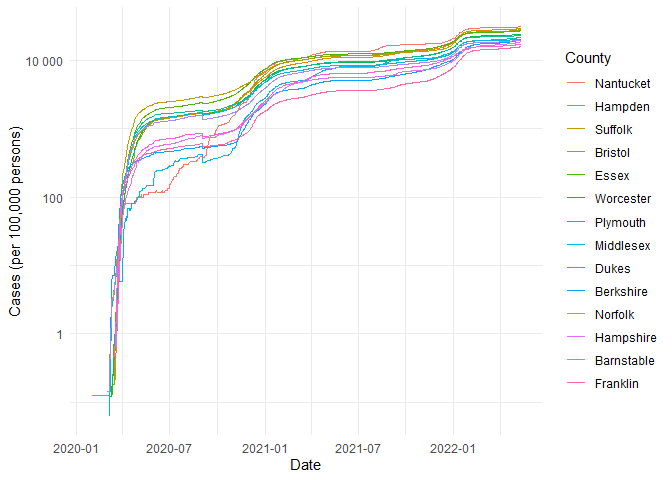

COVID-19
================
(Your name here)
2020-

- [Grading Rubric](#grading-rubric)
  - [Individual](#individual)
  - [Submission](#submission)
- [The Big Picture](#the-big-picture)
- [Get the Data](#get-the-data)
  - [Navigating the Census Bureau](#navigating-the-census-bureau)
    - [**q1** Load Table `B01003` into the following tibble. Make sure
      the column names are
      `id, Geographic Area Name, Estimate!!Total, Margin of Error!!Total`.](#q1-load-table-b01003-into-the-following-tibble-make-sure-the-column-names-are-id-geographic-area-name-estimatetotal-margin-of-errortotal)
  - [Automated Download of NYT Data](#automated-download-of-nyt-data)
    - [**q2** Visit the NYT GitHub repo and find the URL for the **raw**
      US County-level data. Assign that URL as a string to the variable
      below.](#q2-visit-the-nyt-github-repo-and-find-the-url-for-the-raw-us-county-level-data-assign-that-url-as-a-string-to-the-variable-below)
- [Join the Data](#join-the-data)
  - [**q3** Process the `id` column of `df_pop` to create a `fips`
    column.](#q3-process-the-id-column-of-df_pop-to-create-a-fips-column)
  - [**q4** Join `df_covid` with `df_q3` by the `fips` column. Use the
    proper type of join to preserve *only* the rows in
    `df_covid`.](#q4-join-df_covid-with-df_q3-by-the-fips-column-use-the-proper-type-of-join-to-preserve-only-the-rows-in-df_covid)
- [Analyze](#analyze)
  - [Normalize](#normalize)
    - [**q5** Use the `population` estimates in `df_data` to normalize
      `cases` and `deaths` to produce per 100,000 counts \[3\]. Store
      these values in the columns `cases_per100k` and
      `deaths_per100k`.](#q5-use-the-population-estimates-in-df_data-to-normalize-cases-and-deaths-to-produce-per-100000-counts-3-store-these-values-in-the-columns-cases_per100k-and-deaths_per100k)
  - [Guided EDA](#guided-eda)
    - [**q6** Compute some summaries](#q6-compute-some-summaries)
    - [**q7** Find and compare the top
      10](#q7-find-and-compare-the-top-10)
  - [Self-directed EDA](#self-directed-eda)
    - [**q8** Drive your own ship: You’ve just put together a very rich
      dataset; you now get to explore! Pick your own direction and
      generate at least one punchline figure to document an interesting
      finding. I give a couple tips & ideas
      below:](#q8-drive-your-own-ship-youve-just-put-together-a-very-rich-dataset-you-now-get-to-explore-pick-your-own-direction-and-generate-at-least-one-punchline-figure-to-document-an-interesting-finding-i-give-a-couple-tips--ideas-below)
    - [Ideas](#ideas)
    - [Aside: Some visualization
      tricks](#aside-some-visualization-tricks)
    - [Geographic exceptions](#geographic-exceptions)
- [Notes](#notes)

*Purpose*: In this challenge, you’ll learn how to navigate the U.S.
Census Bureau website, programmatically download data from the internet,
and perform a county-level population-weighted analysis of current
COVID-19 trends. This will give you the base for a very deep
investigation of COVID-19, which we’ll build upon for Project 1.

<!-- include-rubric -->

# Grading Rubric

<!-- -------------------------------------------------- -->

Unlike exercises, **challenges will be graded**. The following rubrics
define how you will be graded, both on an individual and team basis.

## Individual

<!-- ------------------------- -->

| Category | Needs Improvement | Satisfactory |
|----|----|----|
| Effort | Some task **q**’s left unattempted | All task **q**’s attempted |
| Observed | Did not document observations, or observations incorrect | Documented correct observations based on analysis |
| Supported | Some observations not clearly supported by analysis | All observations clearly supported by analysis (table, graph, etc.) |
| Assessed | Observations include claims not supported by the data, or reflect a level of certainty not warranted by the data | Observations are appropriately qualified by the quality & relevance of the data and (in)conclusiveness of the support |
| Specified | Uses the phrase “more data are necessary” without clarification | Any statement that “more data are necessary” specifies which *specific* data are needed to answer what *specific* question |
| Code Styled | Violations of the [style guide](https://style.tidyverse.org/) hinder readability | Code sufficiently close to the [style guide](https://style.tidyverse.org/) |

## Submission

<!-- ------------------------- -->

Make sure to commit both the challenge report (`report.md` file) and
supporting files (`report_files/` folder) when you are done! Then submit
a link to Canvas. **Your Challenge submission is not complete without
all files uploaded to GitHub.**

``` r
library(tidyverse)
```

    ## ── Attaching core tidyverse packages ──────────────────────── tidyverse 2.0.0 ──
    ## ✔ dplyr     1.1.4     ✔ readr     2.1.5
    ## ✔ forcats   1.0.0     ✔ stringr   1.5.1
    ## ✔ ggplot2   3.5.1     ✔ tibble    3.2.1
    ## ✔ lubridate 1.9.4     ✔ tidyr     1.3.1
    ## ✔ purrr     1.0.2     
    ## ── Conflicts ────────────────────────────────────────── tidyverse_conflicts() ──
    ## ✖ dplyr::filter() masks stats::filter()
    ## ✖ dplyr::lag()    masks stats::lag()
    ## ℹ Use the conflicted package (<http://conflicted.r-lib.org/>) to force all conflicts to become errors

*Background*:
[COVID-19](https://en.wikipedia.org/wiki/Coronavirus_disease_2019) is
the disease caused by the virus SARS-CoV-2. In 2020 it became a global
pandemic, leading to huge loss of life and tremendous disruption to
society. The New York Times (as of writing) publishes up-to-date data on
the progression of the pandemic across the United States—we will study
these data in this challenge.

*Optional Readings*: I’ve found this [ProPublica
piece](https://www.propublica.org/article/how-to-understand-covid-19-numbers)
on “How to understand COVID-19 numbers” to be very informative!

# The Big Picture

<!-- -------------------------------------------------- -->

We’re about to go through *a lot* of weird steps, so let’s first fix the
big picture firmly in mind:

We want to study COVID-19 in terms of data: both case counts (number of
infections) and deaths. We’re going to do a county-level analysis in
order to get a high-resolution view of the pandemic. Since US counties
can vary widely in terms of their population, we’ll need population
estimates in order to compute infection rates (think back to the
`Titanic` challenge).

That’s the high-level view; now let’s dig into the details.

# Get the Data

<!-- -------------------------------------------------- -->

1.  County-level population estimates (Census Bureau)
2.  County-level COVID-19 counts (New York Times)

## Navigating the Census Bureau

<!-- ------------------------- -->

**Steps**: Our objective is to find the 2018 American Community
Survey\[1\] (ACS) Total Population estimates, disaggregated by counties.
To check your results, this is Table `B01003`.

1.  Go to [data.census.gov](data.census.gov).
2.  Scroll down and click `View Tables`.
3.  Apply filters to find the ACS **Total Population** estimates,
    disaggregated by counties. I used the filters:

- `Topics > Populations and People > Counts, Estimates, and Projections > Population Total`
- `Geography > County > All counties in United States`

5.  Select the **Total Population** table and click the `Download`
    button to download the data; make sure to select the 2018 5-year
    estimates.
6.  Unzip and move the data to your `challenges/data` folder.

- Note that the data will have a crazy-long filename like
  `ACSDT5Y2018.B01003_data_with_overlays_2020-07-26T094857.csv`. That’s
  because metadata is stored in the filename, such as the year of the
  estimate (`Y2018`) and my access date (`2020-07-26`). **Your filename
  will vary based on when you download the data**, so make sure to copy
  the filename that corresponds to what you downloaded!

### **q1** Load Table `B01003` into the following tibble. Make sure the column names are `id, Geographic Area Name, Estimate!!Total, Margin of Error!!Total`.

*Hint*: You will need to use the `skip` keyword when loading these data!

``` r
## TASK: Load the census bureau data with the following tibble name.
df_pop <- read.csv(
  "./data/ACSDT5Y2018.B01003-Data.csv",
  skip = 1) %>% 
  rename("id" = "Geography", 
         "Geographic Area Name" = "Geographic.Area.Name", 
         "Estimate!!Total" = "Estimate..Total",
         "Margin of Error!!Total" ="Margin.of.Error..Total") %>% 
  select(
    'id', 
    'Geographic Area Name', 
    'Estimate!!Total', 
    'Margin of Error!!Total')
```

*Note*: You can find information on 1-year, 3-year, and 5-year estimates
[here](https://www.census.gov/programs-surveys/acs/guidance/estimates.html).
The punchline is that 5-year estimates are more reliable but less
current.

## Automated Download of NYT Data

<!-- ------------------------- -->

ACS 5-year estimates don’t change all that often, but the COVID-19 data
are changing rapidly. To that end, it would be nice to be able to
*programmatically* download the most recent data for analysis; that way
we can update our analysis whenever we want simply by re-running our
notebook. This next problem will have you set up such a pipeline.

The New York Times is publishing up-to-date data on COVID-19 on
[GitHub](https://github.com/nytimes/covid-19-data).

### **q2** Visit the NYT [GitHub](https://github.com/nytimes/covid-19-data) repo and find the URL for the **raw** US County-level data. Assign that URL as a string to the variable below.

``` r
## TASK: Find the URL for the NYT covid-19 county-level data
url_counties <- 'https://raw.githubusercontent.com/nytimes/covid-19-data/refs/heads/master/us-counties.csv'
```

Once you have the url, the following code will download a local copy of
the data, then load the data into R.

``` r
## NOTE: No need to change this; just execute
## Set the filename of the data to download
filename_nyt <- "./data/nyt_counties.csv"

## Download the data locally
curl::curl_download(
        url_counties,
        destfile = filename_nyt
      )

## Loads the downloaded csv
df_covid <- read_csv(filename_nyt)
```

    ## Rows: 2502832 Columns: 6
    ## ── Column specification ────────────────────────────────────────────────────────
    ## Delimiter: ","
    ## chr  (3): county, state, fips
    ## dbl  (2): cases, deaths
    ## date (1): date
    ## 
    ## ℹ Use `spec()` to retrieve the full column specification for this data.
    ## ℹ Specify the column types or set `show_col_types = FALSE` to quiet this message.

You can now re-run the chunk above (or the entire notebook) to pull the
most recent version of the data. Thus you can periodically re-run this
notebook to check in on the pandemic as it evolves.

*Note*: You should feel free to copy-paste the code above for your own
future projects!

# Join the Data

<!-- -------------------------------------------------- -->

To get a sense of our task, let’s take a glimpse at our two data
sources.

``` r
## NOTE: No need to change this; just execute
df_pop %>% glimpse
```

    ## Rows: 3,220
    ## Columns: 4
    ## $ id                       <chr> "0500000US01001", "0500000US01003", "0500000U…
    ## $ `Geographic Area Name`   <chr> "Autauga County, Alabama", "Baldwin County, A…
    ## $ `Estimate!!Total`        <int> 55200, 208107, 25782, 22527, 57645, 10352, 20…
    ## $ `Margin of Error!!Total` <chr> "*****", "*****", "*****", "*****", "*****", …

``` r
df_covid %>% glimpse
```

    ## Rows: 2,502,832
    ## Columns: 6
    ## $ date   <date> 2020-01-21, 2020-01-22, 2020-01-23, 2020-01-24, 2020-01-24, 20…
    ## $ county <chr> "Snohomish", "Snohomish", "Snohomish", "Cook", "Snohomish", "Or…
    ## $ state  <chr> "Washington", "Washington", "Washington", "Illinois", "Washingt…
    ## $ fips   <chr> "53061", "53061", "53061", "17031", "53061", "06059", "17031", …
    ## $ cases  <dbl> 1, 1, 1, 1, 1, 1, 1, 1, 1, 1, 1, 1, 1, 1, 1, 1, 1, 1, 1, 1, 1, …
    ## $ deaths <dbl> 0, 0, 0, 0, 0, 0, 0, 0, 0, 0, 0, 0, 0, 0, 0, 0, 0, 0, 0, 0, 0, …

To join these datasets, we’ll need to use [FIPS county
codes](https://en.wikipedia.org/wiki/FIPS_county_code).\[2\] The last
`5` digits of the `id` column in `df_pop` is the FIPS county code, while
the NYT data `df_covid` already contains the `fips`.

### **q3** Process the `id` column of `df_pop` to create a `fips` column.

``` r
## TASK: Create a `fips` column by extracting the county code
df_q3 <- df_pop %>% 
  mutate(
    fips = str_sub(id, -5)
  )
```

Use the following test to check your answer.

``` r
## NOTE: No need to change this
## Check known county
assertthat::assert_that(
              (df_q3 %>%
              filter(str_detect(`Geographic Area Name`, "Autauga County")) %>%
              pull(fips)) == "01001"
            )
```

    ## [1] TRUE

``` r
print("Very good!")
```

    ## [1] "Very good!"

### **q4** Join `df_covid` with `df_q3` by the `fips` column. Use the proper type of join to preserve *only* the rows in `df_covid`.

``` r
## TASK: Join df_covid and df_q3 by fips.
df_q4 <- left_join(df_covid, df_q3, by = 'fips')
df_q4
```

    ## # A tibble: 2,502,832 × 10
    ##    date       county      state  fips  cases deaths id    `Geographic Area Name`
    ##    <date>     <chr>       <chr>  <chr> <dbl>  <dbl> <chr> <chr>                 
    ##  1 2020-01-21 Snohomish   Washi… 53061     1      0 0500… Snohomish County, Was…
    ##  2 2020-01-22 Snohomish   Washi… 53061     1      0 0500… Snohomish County, Was…
    ##  3 2020-01-23 Snohomish   Washi… 53061     1      0 0500… Snohomish County, Was…
    ##  4 2020-01-24 Cook        Illin… 17031     1      0 0500… Cook County, Illinois 
    ##  5 2020-01-24 Snohomish   Washi… 53061     1      0 0500… Snohomish County, Was…
    ##  6 2020-01-25 Orange      Calif… 06059     1      0 0500… Orange County, Califo…
    ##  7 2020-01-25 Cook        Illin… 17031     1      0 0500… Cook County, Illinois 
    ##  8 2020-01-25 Snohomish   Washi… 53061     1      0 0500… Snohomish County, Was…
    ##  9 2020-01-26 Maricopa    Arizo… 04013     1      0 0500… Maricopa County, Ariz…
    ## 10 2020-01-26 Los Angeles Calif… 06037     1      0 0500… Los Angeles County, C…
    ## # ℹ 2,502,822 more rows
    ## # ℹ 2 more variables: `Estimate!!Total` <int>, `Margin of Error!!Total` <chr>

Use the following test to check your answer.

``` r
## NOTE: No need to change this
if (!any(df_q4 %>% pull(fips) %>% str_detect(., "02105"), na.rm = TRUE)) {
  assertthat::assert_that(TRUE)
} else {
  print(str_c(
    "Your df_q4 contains a row for the Hoonah-Angoon Census Area (AK),",
    "which is not in df_covid. You used the incorrect join type.",
    sep = " "
  ))
  assertthat::assert_that(FALSE)
}
```

    ## [1] TRUE

``` r
if (any(df_q4 %>% pull(fips) %>% str_detect(., "78010"), na.rm = TRUE)) {
  assertthat::assert_that(TRUE)
} else {
  print(str_c(
    "Your df_q4 does not include St. Croix, US Virgin Islands,",
    "which is in df_covid. You used the incorrect join type.",
    sep = " "
  ))
  assertthat::assert_that(FALSE)
}
```

    ## [1] TRUE

``` r
print("Very good!")
```

    ## [1] "Very good!"

For convenience, I down-select some columns and produce more convenient
column names.

``` r
## NOTE: No need to change; run this to produce a more convenient tibble
df_data <-
  df_q4 %>%
  select(
    date,
    county,
    state,
    fips,
    cases,
    deaths,
    population = `Estimate!!Total`
  )
```

# Analyze

<!-- -------------------------------------------------- -->

Now that we’ve done the hard work of loading and wrangling the data, we
can finally start our analysis. Our first step will be to produce county
population-normalized cases and death counts. Then we will explore the
data.

## Normalize

<!-- ------------------------- -->

### **q5** Use the `population` estimates in `df_data` to normalize `cases` and `deaths` to produce per 100,000 counts \[3\]. Store these values in the columns `cases_per100k` and `deaths_per100k`.

``` r
## TASK: Normalize cases and deaths
df_normalized <- df_data %>% 
  mutate(
    cases_per100k = 1e5 * cases / population,
    deaths_per100k = 1e5 * deaths / population
  )
df_normalized
```

    ## # A tibble: 2,502,832 × 9
    ##    date       county      state      fips  cases deaths population cases_per100k
    ##    <date>     <chr>       <chr>      <chr> <dbl>  <dbl>      <int>         <dbl>
    ##  1 2020-01-21 Snohomish   Washington 53061     1      0     786620       0.127  
    ##  2 2020-01-22 Snohomish   Washington 53061     1      0     786620       0.127  
    ##  3 2020-01-23 Snohomish   Washington 53061     1      0     786620       0.127  
    ##  4 2020-01-24 Cook        Illinois   17031     1      0    5223719       0.0191 
    ##  5 2020-01-24 Snohomish   Washington 53061     1      0     786620       0.127  
    ##  6 2020-01-25 Orange      California 06059     1      0    3164182       0.0316 
    ##  7 2020-01-25 Cook        Illinois   17031     1      0    5223719       0.0191 
    ##  8 2020-01-25 Snohomish   Washington 53061     1      0     786620       0.127  
    ##  9 2020-01-26 Maricopa    Arizona    04013     1      0    4253913       0.0235 
    ## 10 2020-01-26 Los Angeles California 06037     1      0   10098052       0.00990
    ## # ℹ 2,502,822 more rows
    ## # ℹ 1 more variable: deaths_per100k <dbl>

You may use the following test to check your work.

``` r
## NOTE: No need to change this
## Check known county data
if (any(df_normalized %>% pull(date) %>% str_detect(., "2020-01-21"))) {
  assertthat::assert_that(TRUE)
} else {
  print(str_c(
    "Date 2020-01-21 not found; did you download the historical data (correct),",
    "or just the most recent data (incorrect)?",
    sep = " "
  ))
  assertthat::assert_that(FALSE)
}
```

    ## [1] TRUE

``` r
if (any(df_normalized %>% pull(date) %>% str_detect(., "2022-05-13"))) {
  assertthat::assert_that(TRUE)
} else {
  print(str_c(
    "Date 2022-05-13 not found; did you download the historical data (correct),",
    "or a single year's data (incorrect)?",
    sep = " "
  ))
  assertthat::assert_that(FALSE)
}
```

    ## [1] TRUE

``` r
## Check datatypes
assertthat::assert_that(is.numeric(df_normalized$cases))
```

    ## [1] TRUE

``` r
assertthat::assert_that(is.numeric(df_normalized$deaths))
```

    ## [1] TRUE

``` r
assertthat::assert_that(is.numeric(df_normalized$population))
```

    ## [1] TRUE

``` r
assertthat::assert_that(is.numeric(df_normalized$cases_per100k))
```

    ## [1] TRUE

``` r
assertthat::assert_that(is.numeric(df_normalized$deaths_per100k))
```

    ## [1] TRUE

``` r
## Check that normalization is correct
assertthat::assert_that(
              abs(df_normalized %>%
               filter(
                 str_detect(county, "Snohomish"),
                 date == "2020-01-21"
               ) %>%
              pull(cases_per100k) - 0.127) < 1e-3
            )
```

    ## [1] TRUE

``` r
assertthat::assert_that(
              abs(df_normalized %>%
               filter(
                 str_detect(county, "Snohomish"),
                 date == "2020-01-21"
               ) %>%
              pull(deaths_per100k) - 0) < 1e-3
            )
```

    ## [1] TRUE

``` r
print("Excellent!")
```

    ## [1] "Excellent!"

## Guided EDA

<!-- ------------------------- -->

Before turning you loose, let’s complete a couple guided EDA tasks.

### **q6** Compute some summaries

Compute the mean and standard deviation for `cases_per100k` and
`deaths_per100k`. *Make sure to carefully choose **which rows** to
include in your summaries,* and justify why!

``` r
## TASK: Compute mean and sd for cases_per100k and deaths_per100k
df_normalized %>%
  summarize(
    cases_per100k_mean = mean(cases_per100k, na.rm = TRUE),
    cases_per100k_sd = sd(cases_per100k, na.rm = TRUE),
    deaths_per100k_mean = mean(deaths_per100k, na.rm = TRUE),
    deaths_per100k_sd = sd(deaths_per100k, na.rm = TRUE)
  )
```

    ## # A tibble: 1 × 4
    ##   cases_per100k_mean cases_per100k_sd deaths_per100k_mean deaths_per100k_sd
    ##                <dbl>            <dbl>               <dbl>             <dbl>
    ## 1              9975.            8449.                174.              159.

- Which rows did you pick?
  - (Your response here)
- Why?
  - (Your response here)

### **q7** Find and compare the top 10

Find the top 10 counties in terms of `cases_per100k`, and the top 10 in
terms of `deaths_per100k`. Report the population of each county along
with the per-100,000 counts. Compare the counts against the mean values
you found in q6. Note any observations.

``` r
## TASK: Find the top 10 max cases_per100k counties; report populations as well
df_normalized %>%
  group_by(county, state, population) %>%
  summarize(top_cases_per100k = max(cases_per100k)) %>%
  arrange(desc(top_cases_per100k))
```

    ## `summarise()` has grouped output by 'county', 'state'. You can override using
    ## the `.groups` argument.

    ## # A tibble: 3,277 × 4
    ## # Groups:   county, state [3,277]
    ##    county                   state        population top_cases_per100k
    ##    <chr>                    <chr>             <int>             <dbl>
    ##  1 Loving                   Texas               102           192157.
    ##  2 Chattahoochee            Georgia           10767            69527.
    ##  3 Nome Census Area         Alaska             9925            62922.
    ##  4 Northwest Arctic Borough Alaska             7734            62542.
    ##  5 Crowley                  Colorado           5630            59449.
    ##  6 Bethel Census Area       Alaska            18040            57439.
    ##  7 Dewey                    South Dakota       5779            54317.
    ##  8 Dimmit                   Texas             10663            54019.
    ##  9 Jim Hogg                 Texas              5282            50133.
    ## 10 Kusilvak Census Area     Alaska             8198            49817.
    ## # ℹ 3,267 more rows

``` r
## TASK: Find the top 10 deaths_per100k counties; report populations as well
df_normalized %>%
  group_by(county, state, population) %>%
  summarize(top_deaths_per100k = max(deaths_per100k)) %>%
  arrange(desc(top_deaths_per100k))
```

    ## `summarise()` has grouped output by 'county', 'state'. You can override using
    ## the `.groups` argument.

    ## # A tibble: 3,277 × 4
    ## # Groups:   county, state [3,277]
    ##    county            state        population top_deaths_per100k
    ##    <chr>             <chr>             <int>              <dbl>
    ##  1 McMullen          Texas               662              1360.
    ##  2 Galax city        Virginia           6638              1175.
    ##  3 Motley            Texas              1156              1125.
    ##  4 Hancock           Georgia            8535              1054.
    ##  5 Emporia city      Virginia           5381              1022.
    ##  6 Towns             Georgia           11417              1016.
    ##  7 Jerauld           South Dakota       2029               986.
    ##  8 Loving            Texas               102               980.
    ##  9 Robertson         Kentucky           2143               980.
    ## 10 Martinsville city Virginia          13101               946.
    ## # ℹ 3,267 more rows

**Observations**:

- Top 10 counties for cases are Loving, Chattahoochee, Nome Census Aream
  Northwest Arctic Borough, Crowley, Bethel Census Area, Dewey Dimmit,
  Jim Hogg, and Kusilvak Census Area.
- top_cases_per100k ranged from 49817 to 192156, while
  top_deaths_per100k ranged from 946 to 1359
- The mean for top cases is 9974, while the mean for top deaths is 174
- When did these “largest values” occur?
  - The means for the top cases and deaths are significantly lower than
    the top 10, so the top 10 are likely outliers.

## Self-directed EDA

<!-- ------------------------- -->

### **q8** Drive your own ship: You’ve just put together a very rich dataset; you now get to explore! Pick your own direction and generate at least one punchline figure to document an interesting finding. I give a couple tips & ideas below:

### Ideas

<!-- ------------------------- -->

- Look for outliers.
- Try web searching for news stories in some of the outlier counties.
- Investigate relationships between county population and counts.
- Do a deep-dive on counties that are important to you (e.g. where you
  or your family live).
- Fix the *geographic exceptions* noted below to study New York City.
- Your own idea!

**DO YOUR OWN ANALYSIS HERE**

### Aside: Some visualization tricks

<!-- ------------------------- -->

These data get a little busy, so it’s helpful to know a few `ggplot`
tricks to help with the visualization. Here’s an example focused on
Massachusetts.

``` r
## NOTE: No need to change this; just an example
df_normalized %>%
  filter(
    state == "Massachusetts", # Focus on Mass only
    !is.na(fips), # fct_reorder2 can choke with missing data
  ) %>%

  ggplot(
    aes(date, cases_per100k, color = fct_reorder2(county, date, cases_per100k))
  ) +
  geom_line() +
  scale_y_log10(labels = scales::label_number()) +
  scale_color_discrete(name = "County") +
  theme_minimal() +
  labs(
    x = "Date",
    y = "Cases (per 100,000 persons)"
  )
```

<!-- -->

*Tricks*:

- I use `fct_reorder2` to *re-order* the color labels such that the
  color in the legend on the right is ordered the same as the vertical
  order of rightmost points on the curves. This makes it easier to
  reference the legend.
- I manually set the `name` of the color scale in order to avoid
  reporting the `fct_reorder2` call.
- I use `scales::label_number_si` to make the vertical labels more
  readable.
- I use `theme_minimal()` to clean up the theme a bit.
- I use `labs()` to give manual labels.

### Geographic exceptions

<!-- ------------------------- -->

The NYT repo documents some [geographic
exceptions](https://github.com/nytimes/covid-19-data#geographic-exceptions);
the data for New York, Kings, Queens, Bronx and Richmond counties are
consolidated under “New York City” *without* a fips code. Thus the
normalized counts in `df_normalized` are `NA`. To fix this, you would
need to merge the population data from the New York City counties, and
manually normalize the data.

``` r
df_pop %>%
  filter(str_detect(`Geographic Area Name`, "New York"))
```

    ##                id          Geographic Area Name Estimate!!Total
    ## 1  0500000US36001       Albany County, New York          307426
    ## 2  0500000US36003     Allegany County, New York           47025
    ## 3  0500000US36005        Bronx County, New York         1437872
    ## 4  0500000US36007       Broome County, New York          194402
    ## 5  0500000US36009  Cattaraugus County, New York           77686
    ## 6  0500000US36011       Cayuga County, New York           77868
    ## 7  0500000US36013   Chautauqua County, New York          129656
    ## 8  0500000US36015      Chemung County, New York           85740
    ## 9  0500000US36017     Chenango County, New York           48348
    ## 10 0500000US36019      Clinton County, New York           80794
    ## 11 0500000US36021     Columbia County, New York           60919
    ## 12 0500000US36023     Cortland County, New York           48123
    ## 13 0500000US36025     Delaware County, New York           45502
    ## 14 0500000US36027     Dutchess County, New York          293894
    ## 15 0500000US36029         Erie County, New York          919866
    ## 16 0500000US36031        Essex County, New York           37751
    ## 17 0500000US36033     Franklin County, New York           50692
    ## 18 0500000US36035       Fulton County, New York           53743
    ## 19 0500000US36037      Genesee County, New York           58112
    ## 20 0500000US36039       Greene County, New York           47617
    ## 21 0500000US36041     Hamilton County, New York            4575
    ## 22 0500000US36043     Herkimer County, New York           62505
    ## 23 0500000US36045    Jefferson County, New York          114448
    ## 24 0500000US36047        Kings County, New York         2600747
    ## 25 0500000US36049        Lewis County, New York           26719
    ## 26 0500000US36051   Livingston County, New York           63907
    ## 27 0500000US36053      Madison County, New York           71359
    ## 28 0500000US36055       Monroe County, New York          744248
    ## 29 0500000US36057   Montgomery County, New York           49426
    ## 30 0500000US36059       Nassau County, New York         1356564
    ## 31 0500000US36061     New York County, New York         1632480
    ## 32 0500000US36063      Niagara County, New York          211704
    ## 33 0500000US36065       Oneida County, New York          230782
    ## 34 0500000US36067     Onondaga County, New York          464242
    ## 35 0500000US36069      Ontario County, New York          109472
    ## 36 0500000US36071       Orange County, New York          378227
    ## 37 0500000US36073      Orleans County, New York           41175
    ## 38 0500000US36075       Oswego County, New York          119104
    ## 39 0500000US36077       Otsego County, New York           60244
    ## 40 0500000US36079       Putnam County, New York           99070
    ## 41 0500000US36081       Queens County, New York         2298513
    ## 42 0500000US36083   Rensselaer County, New York          159431
    ## 43 0500000US36085     Richmond County, New York          474101
    ## 44 0500000US36087     Rockland County, New York          323686
    ## 45 0500000US36089 St. Lawrence County, New York          109558
    ## 46 0500000US36091     Saratoga County, New York          227377
    ## 47 0500000US36093  Schenectady County, New York          154883
    ## 48 0500000US36095    Schoharie County, New York           31364
    ## 49 0500000US36097     Schuyler County, New York           17992
    ## 50 0500000US36099       Seneca County, New York           34612
    ## 51 0500000US36101      Steuben County, New York           96927
    ## 52 0500000US36103      Suffolk County, New York         1487901
    ## 53 0500000US36105     Sullivan County, New York           75211
    ## 54 0500000US36107        Tioga County, New York           49045
    ## 55 0500000US36109     Tompkins County, New York          102962
    ## 56 0500000US36111       Ulster County, New York          179303
    ## 57 0500000US36113       Warren County, New York           64480
    ## 58 0500000US36115   Washington County, New York           61828
    ## 59 0500000US36117        Wayne County, New York           90856
    ## 60 0500000US36119  Westchester County, New York          968815
    ## 61 0500000US36121      Wyoming County, New York           40565
    ## 62 0500000US36123        Yates County, New York           25009
    ##    Margin of Error!!Total
    ## 1                   *****
    ## 2                   *****
    ## 3                   *****
    ## 4                   *****
    ## 5                   *****
    ## 6                   *****
    ## 7                   *****
    ## 8                   *****
    ## 9                   *****
    ## 10                  *****
    ## 11                  *****
    ## 12                  *****
    ## 13                  *****
    ## 14                  *****
    ## 15                  *****
    ## 16                  *****
    ## 17                  *****
    ## 18                  *****
    ## 19                  *****
    ## 20                  *****
    ## 21                  *****
    ## 22                  *****
    ## 23                  *****
    ## 24                  *****
    ## 25                  *****
    ## 26                  *****
    ## 27                  *****
    ## 28                  *****
    ## 29                  *****
    ## 30                  *****
    ## 31                  *****
    ## 32                  *****
    ## 33                  *****
    ## 34                  *****
    ## 35                  *****
    ## 36                  *****
    ## 37                  *****
    ## 38                  *****
    ## 39                  *****
    ## 40                  *****
    ## 41                  *****
    ## 42                  *****
    ## 43                  *****
    ## 44                  *****
    ## 45                  *****
    ## 46                  *****
    ## 47                  *****
    ## 48                  *****
    ## 49                  *****
    ## 50                  *****
    ## 51                  *****
    ## 52                  *****
    ## 53                  *****
    ## 54                  *****
    ## 55                  *****
    ## 56                  *****
    ## 57                  *****
    ## 58                  *****
    ## 59                  *****
    ## 60                  *****
    ## 61                  *****
    ## 62                  *****

``` r
df_nyc_pop <- df_pop %>% 
  filter(str_detect(`Geographic Area Name`, "Kings|Queens|Bronx|New York|Richmond")) %>% 
  summarise(nyc_pop = sum(`Estimate!!Total`, na.rm = TRUE)) %>% 
  pull(nyc_pop)

df_nyc_pop
```

    ## [1] 20252812

``` r
# df_nyc <- left_join(df_covid_nyc, df_nyc_pop, by = "Geographic Area Name")
# df_nyc
```

# Notes

<!-- -------------------------------------------------- -->

\[1\] The census used to have many, many questions, but the ACS was
created in 2010 to remove some questions and shorten the census. You can
learn more in [this wonderful visual
history](https://pudding.cool/2020/03/census-history/) of the census.

\[2\] FIPS stands for [Federal Information Processing
Standards](https://en.wikipedia.org/wiki/Federal_Information_Processing_Standards);
these are computer standards issued by NIST for things such as
government data.

\[3\] Demographers often report statistics not in percentages (per 100
people), but rather in per 100,000 persons. This is [not always the
case](https://stats.stackexchange.com/questions/12810/why-do-demographers-give-rates-per-100-000-people)
though!
