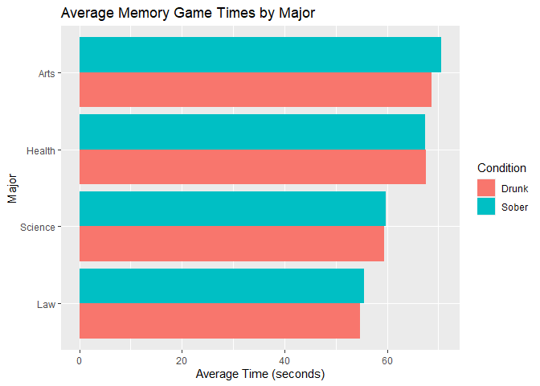
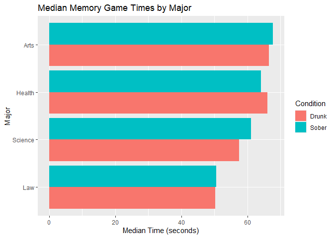
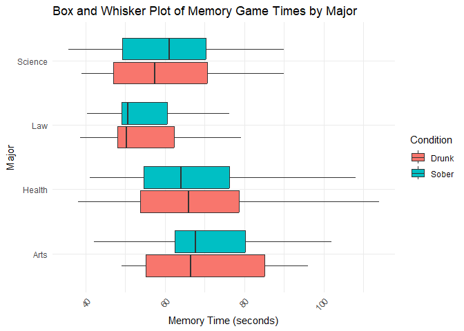
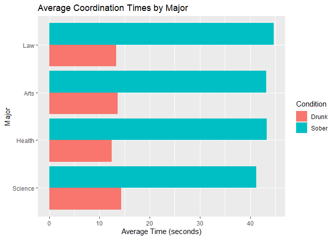
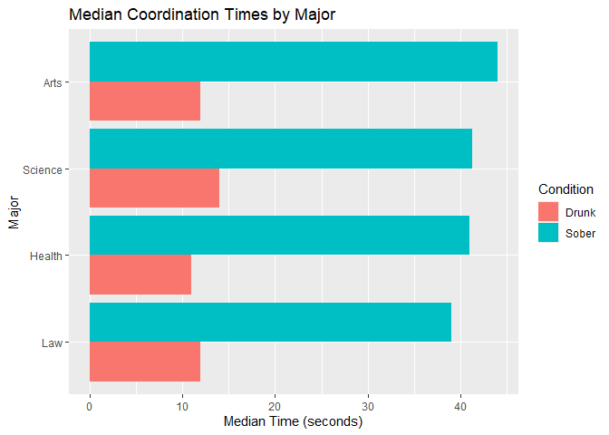
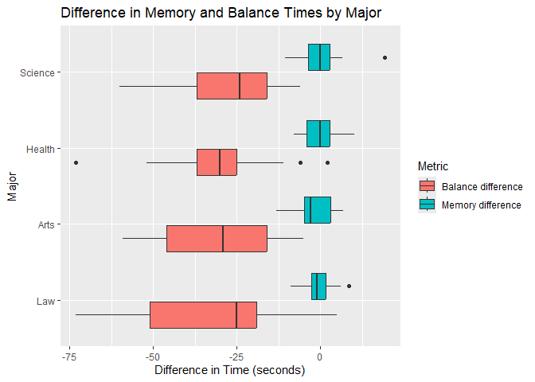

The Islands, Part 2: Study
================
Suwanee Li, Lucien Lin, Allyson Hur, Michaela Fox, Ariel Chen, Rohan
Giancaspro
2025-04-12

- [Grading Rubric](#grading-rubric)
  - [Individual](#individual)
  - [Submission](#submission)
- [Setup](#setup)
  - [**q1** Planning a study (TEAMWORK)](#q1-planning-a-study-teamwork)
  - [**q2** EDA](#q2-eda)
  - [**q3** Key Analyses](#q3-key-analyses)
  - [**q4** Answers](#q4-answers)

*Purpose*: This is part 2 of 2. In part 1 you *planed* your statistical
project, particularly your data collection. In this part you will give
updates on your plan, and report your findings.

This challenge is deliberately shorter so you have time to collect and
analyze your data.

*Important note*: While we expect that you did your data collection with
your team, you need to complete your own individual report for c10.

<!-- include-rubric -->

# Grading Rubric

<!-- -------------------------------------------------- -->

Unlike exercises, **challenges will be graded**. The following rubrics
define how you will be graded, both on an individual and team basis.

## Individual

<!-- ------------------------- -->

| Category | Needs Improvement | Satisfactory |
|----|----|----|
| Effort | Some task **q**’s left unattempted | All task **q**’s attempted |
| Observed | Did not document observations, or observations incorrect | Documented correct observations based on analysis |
| Supported | Some observations not clearly supported by analysis | All observations clearly supported by analysis (table, graph, etc.) |
| Assessed | Observations include claims not supported by the data, or reflect a level of certainty not warranted by the data | Observations are appropriately qualified by the quality & relevance of the data and (in)conclusiveness of the support |
| Specified | Uses the phrase “more data are necessary” without clarification | Any statement that “more data are necessary” specifies which *specific* data are needed to answer what *specific* question |
| Code Styled | Violations of the [style guide](https://style.tidyverse.org/) hinder readability | Code sufficiently close to the [style guide](https://style.tidyverse.org/) |

## Submission

<!-- ------------------------- -->

Make sure to commit both the challenge report (`report.md` file) and
supporting files (`report_files/` folder) when you are done! Then submit
a link to Canvas. **Your Challenge submission is not complete without
all files uploaded to GitHub.**

# Setup

<!-- ----------------------------------------------------------------------- -->

``` r
library(tidyverse)
```

    ## ── Attaching core tidyverse packages ──────────────────────── tidyverse 2.0.0 ──
    ## ✔ dplyr     1.1.4     ✔ readr     2.1.5
    ## ✔ forcats   1.0.0     ✔ stringr   1.5.1
    ## ✔ ggplot2   3.5.1     ✔ tibble    3.2.1
    ## ✔ lubridate 1.9.4     ✔ tidyr     1.3.1
    ## ✔ purrr     1.0.2     
    ## ── Conflicts ────────────────────────────────────────── tidyverse_conflicts() ──
    ## ✖ dplyr::filter() masks stats::filter()
    ## ✖ dplyr::lag()    masks stats::lag()
    ## ℹ Use the conflicted package (<http://conflicted.r-lib.org/>) to force all conflicts to become errors

``` r
library(rsample)
library(dplyr)

# TODO: Include any other packages you need
```

### **q1** Planning a study (TEAMWORK)

While you provided this plan in c08 (Part 1), please include your plan
here. In particular, describe how you updated your plan in response to
feedback.

#### Population

- (What population are you going to study?)
  - All of the Islanders? Only the residents of Helvig? Participants
    meeting certain criteria (in which case, you need to list
    *covariates*)?
  - Students at the University of Arcadia are in the arts, law, science,
    and health majors.

#### Quantity of interest

- Pre and post-drinking mental test results (memory game)
- Pre and post-drinking coordination results (balance test with eyes
  closed)

#### Covariates

- Blood alcohol content (BAC)
- Major 

#### Observation or experiment?

The Islands allows you to ask islanders to complete tasks. If you just
take measurements on your participants, then it’s an *observational
study*. But if you also introduce something that’s meant to change the
outcome of a measurement (e.g., drinking coffee before taking a test),
that’s called an *experimental study*. You need to decide whether your
study is observational or experimental.

- The study is experimental. We are having the subjects perform a mental
  and coordination test before and after consuming six shots of vodka.

#### Question / Hypothesis

- (Write your question / hypothesis here)
  - This could be an observational question, like “How are X and Y
    related in the population?”
  - This could be an experimental question, like “What effect does X
    have on Y in the population?”
  - Which major(s) are most likely to perform the best coordination-wise
    before the influence of alcohol? What about mentally?
    - We suspect that law majors will perform the best in coordination
      and mentally prior to the presence of alcohol. This is because
      being the occupation is extremely demanding in terms of thinking
      quickly on one’s feet and being organized. We also believe this
      mental strength will transfer to coordination as well because, as
      some people say, most physical activities are dependent on one’s
      mental state.
  - Which major(s) are most likely to perform the best coordination-wise
    when under the influence of alcohol? What about mentally?
    - We suspect that the art majors will perform the best when under
      the influence of alcohol. Art is a very free-flowing medium, so we
      believe the art students will be the most adaptable. 
  - Which major(s) are most likely to have their mental performance
    affected by alcohol? What about coordination-wise?
    - We suspect that science majors will be drastically affected by the
      influence of alcohol. We believe this is because of the academic
      demands of the major. Science majors would have quite a heavy
      workload, so they generally wouldn’t drink as much.

#### Sampling plan

- (What steps will you take to collect the data?)
  - Be specific. For instance, if you’re going to collect a random
    sample, how will you enumerate all of the things to be sampled?
    - We used a random name picker formula in spreadsheets:
      (=ARRAY_CONSTRAIN(SORT(A1:A58, RANDARRAY(COUNTA(A1:A58)), TRUE),
      25, 1))

    - If someone rejected our study, we would replace them using the
      randomizer until we ended up with 25 participants.
  - Write a protocol. Document step-by-step instructions that your team
    will follow. That way, you can feasibly split up data collection
    among the whole team, while making sure each team member doesn’t
    make ad hoc decisions that introduce bias into your results.
    - Randomize 25 names from a major using the randomizer equation. 
      - Obtain consent from all 25 members; if members decline consent,
        replace the member with another member from the same major.
    - Open links for all the 25 subjects.
    - Give each subject the memory game. Then, repeat with the balance
      test with eyes closed. Record BAC.
    - ⁠Set a stopwatch timer.
    - Give everyone vodka 30 mL (one shot).
    - Repeat until each subject has 6 shots.
    - Check timer for 30-45 min so that alcohol can take maximum effect
    - Give each subject the memory game. Continue with the balance test
      with eyes closed. Record BAC.
    - Record in a spreadsheet. 
- (How will you ensure the data is representative of your chosen
  population?)
  - We will randomly sample 25 students from each of our chosen majors.
- (For experiments only: How will you ensure any effects you observe are
  due to the treatment, and not due to other factors?)
  - Alongside using random sampling, we plan on standardizing the tests
    for each individual subject by making sure each subject has an equal
    time during the drinking phase. 
- (How will you choose your sample size?)
  - We chose our sample size of 25 because it was around half the size
    of the smallest major, so it was unlikely that half of the students
    in a given major would decline consent. Additionally, taking 25
    samples seemed like a feasible amount considering our time
    constraint. 

### **q2** EDA

Conduct an EDA on your data. Add as many code chunks as you need. Ensure
your EDA gives enough context of the data for us to understand what
comes next in this report.

- Average & median memory times across all majors before + after

- Average & median coordination times across all majors before + after

- Difference between before and after times for all majors

``` r
df <- read_csv(
  "./data/majorsvalcohol.csv", 
  skip = 1) %>%
  glimpse()
```

    ## Rows: 150 Columns: 11
    ## ── Column specification ────────────────────────────────────────────────────────
    ## Delimiter: ","
    ## chr (3): Major:, Name:, Notes
    ## dbl (8): Memory Game (seconds) - Sober, Balance Test Eyes Closed (seconds) -...
    ## 
    ## ℹ Use `spec()` to retrieve the full column specification for this data.
    ## ℹ Specify the column types or set `show_col_types = FALSE` to quiet this message.

    ## Rows: 150
    ## Columns: 11
    ## $ `Major:`                                     <chr> "Arts", "Arts", "Arts", "…
    ## $ `Name:`                                      <chr> "Mathis Eklund", "Jermain…
    ## $ `Memory Game (seconds) - Sober`              <dbl> 102.0, 62.5, 85.4, 53.8, …
    ## $ `Balance Test Eyes Closed (seconds) - Sober` <dbl> 60, 26, 54, 39, 16, 59, 2…
    ## $ `BAC - Sober`                                <dbl> 0.001, 0.006, 0.000, 0.00…
    ## $ `Memory Game (seconds) - Drunk`              <dbl> 90.0, 57.8, 88.1, 52.5, 6…
    ## $ `Balance Test Eyes Closed (seconds) - Drunk` <dbl> 19, 19, 8, 16, 8, 13, 10,…
    ## $ `BAC - Drunk`                                <dbl> 0.065, 0.060, 0.094, 0.08…
    ## $ `Memory difference`                          <dbl> -12.0, -4.7, 2.7, -1.3, 3…
    ## $ `Balance difference`                         <dbl> -41, -7, -46, -23, -8, -4…
    ## $ Notes                                        <chr> NA, NA, NA, "She got preg…

``` r
# Remove Notes column
df <- df %>% 
  select(-Notes)

# Remove rows with any NA values
df <- 
  na.omit(df)
df %>%
  glimpse()
```

    ## Rows: 108
    ## Columns: 10
    ## $ `Major:`                                     <chr> "Arts", "Arts", "Arts", "…
    ## $ `Name:`                                      <chr> "Mathis Eklund", "Jermain…
    ## $ `Memory Game (seconds) - Sober`              <dbl> 102.0, 62.5, 85.4, 53.8, …
    ## $ `Balance Test Eyes Closed (seconds) - Sober` <dbl> 60, 26, 54, 39, 16, 59, 2…
    ## $ `BAC - Sober`                                <dbl> 0.001, 0.006, 0.000, 0.00…
    ## $ `Memory Game (seconds) - Drunk`              <dbl> 90.0, 57.8, 88.1, 52.5, 6…
    ## $ `Balance Test Eyes Closed (seconds) - Drunk` <dbl> 19, 19, 8, 16, 8, 13, 10,…
    ## $ `BAC - Drunk`                                <dbl> 0.065, 0.060, 0.094, 0.08…
    ## $ `Memory difference`                          <dbl> -12.0, -4.7, 2.7, -1.3, 3…
    ## $ `Balance difference`                         <dbl> -41, -7, -46, -23, -8, -4…

``` r
df <- df %>%
  filter(`Major:` != "Agriculture")

df %>%
  distinct(`Major:`) %>%
  arrange(`Major:`) %>%
  pull(`Major:`)
```

    ## [1] "Arts"    "Health"  "Law"     "Science"

``` r
# Rename for convenience (optional but helpful)
df_clean <- df %>%
  rename(
    Major = `Major:`,
    Memory_Sober = `Memory Game (seconds) - Sober`,
    Memory_Drunk = `Memory Game (seconds) - Drunk`,
    Balance_Sober = `Balance Test Eyes Closed (seconds) - Sober`,
    Balance_Drunk = `Balance Test Eyes Closed (seconds) - Drunk`,
    BAC_Sober = `BAC - Sober`,
    BAC_Drunk = `BAC - Drunk`
  )

df_long <- df_clean %>%
  pivot_longer(
    cols = c(Memory_Sober, Memory_Drunk,
             Balance_Sober, Balance_Drunk,
             BAC_Sober, BAC_Drunk),
    names_to = c("Metric", "Condition"),
    names_sep = "_",
    values_to = "Value"
  )

df_long
```

    ## # A tibble: 600 × 7
    ##    Major `Name:`       `Memory difference` `Balance difference` Metric Condition
    ##    <chr> <chr>                       <dbl>                <dbl> <chr>  <chr>    
    ##  1 Arts  Mathis Eklund               -12                    -41 Memory Sober    
    ##  2 Arts  Mathis Eklund               -12                    -41 Memory Drunk    
    ##  3 Arts  Mathis Eklund               -12                    -41 Balan… Sober    
    ##  4 Arts  Mathis Eklund               -12                    -41 Balan… Drunk    
    ##  5 Arts  Mathis Eklund               -12                    -41 BAC    Sober    
    ##  6 Arts  Mathis Eklund               -12                    -41 BAC    Drunk    
    ##  7 Arts  Jermaine Tiw…                -4.7                   -7 Memory Sober    
    ##  8 Arts  Jermaine Tiw…                -4.7                   -7 Memory Drunk    
    ##  9 Arts  Jermaine Tiw…                -4.7                   -7 Balan… Sober    
    ## 10 Arts  Jermaine Tiw…                -4.7                   -7 Balan… Drunk    
    ## # ℹ 590 more rows
    ## # ℹ 1 more variable: Value <dbl>

``` r
# Average Memory times sober v drunk across major
df_long %>%
  filter(Metric == "Memory") %>%
  group_by(Major, Condition) %>%
  summarise(Average_Time = mean(Value, na.rm = TRUE), .groups = "drop") %>%
  ggplot(aes(x = reorder(Major, Average_Time), y = Average_Time, fill = Condition)) +
  geom_col(position = "dodge") +
  coord_flip() +
  labs(title = "Average Memory Game Times by Major",
       x = "Major", y = "Average Time (seconds)")
```

<!-- -->

``` r
# Median memory times across majors, sober vs drunk
df_long %>%
  filter(Metric == "Memory") %>%
  group_by(Major, Condition) %>%
  summarise(Median_Time = median(Value, na.rm = TRUE), .groups = "drop") %>%
  ggplot(aes(x = reorder(Major, Median_Time), y = Median_Time, fill = Condition)) +
  geom_col(position = "dodge") +
  coord_flip() +
  labs(title = "Median Memory Game Times by Major",
       x = "Major", y = "Median Time (seconds)")
```

<!-- -->

``` r
# Box and whisker plot for memory times (sober vs. drunk)
df_long %>%
  filter(Metric == "Memory") %>%
  ggplot(aes(x = Major, y = Value, fill = Condition)) +
  geom_boxplot() +
  coord_flip() +  # Flip coordinates for better readability
  labs(title = "Box and Whisker Plot of Memory Game Times by Major",
       x = "Major", y = "Memory Time (seconds)") +
  theme_minimal() +
  theme(axis.text.x = element_text(angle = 45, hjust = 1))
```

<!-- -->

``` r
# Pivot for balance coordination times (before and after drinking)
balance_long <- df_clean %>%
  pivot_longer(
    cols = c(Balance_Sober, Balance_Drunk),
    names_to = c("Metric", "Condition"),
    names_sep = "_",
    values_to = "Balance_Time"
  ) %>%
  filter(Metric == "Balance") 
```

``` r
# Average Coordination Times across majors, sober vs drunk
balance_long %>%
  group_by(Major, Condition) %>%
  summarise(Average_Time = mean(Balance_Time, na.rm = TRUE), .groups = "drop") %>%
  ggplot(aes(x = reorder(Major, Average_Time), y = Average_Time, fill = Condition)) +
  geom_col(position = "dodge") +
  coord_flip() +
  labs(title = "Average Coordination Times by Major",
       x = "Major", y = "Average Time (seconds)")
```

<!-- -->

``` r
# Median Coordination Times across majors, sober vs drunk
balance_long %>%
  group_by(Major, Condition) %>%
  summarise(Median_Time = median(Balance_Time, na.rm = TRUE), .groups = "drop") %>%
  ggplot(aes(x = reorder(Major, Median_Time), y = Median_Time, fill = Condition)) +
  geom_col(position = "dodge") +
  coord_flip() +
  labs(title = "Median Coordination Times by Major",
       x = "Major", y = "Median Time (seconds)")
```

<!-- -->

``` r
# Pivot the data to long format for Memory and Balance differences
df_diff_long <- df %>%
  pivot_longer(
    cols = c(`Memory difference`, `Balance difference`),
    names_to = "Metric",
    values_to = "Difference"
  ) 
df_diff_long
```

    ## # A tibble: 200 × 10
    ##    `Major:` `Name:`  Memory Game (seconds…¹ Balance Test Eyes Cl…² `BAC - Sober`
    ##    <chr>    <chr>                     <dbl>                  <dbl>         <dbl>
    ##  1 Arts     Mathis …                  102                       60         0.001
    ##  2 Arts     Mathis …                  102                       60         0.001
    ##  3 Arts     Jermain…                   62.5                     26         0.006
    ##  4 Arts     Jermain…                   62.5                     26         0.006
    ##  5 Arts     Sage Su…                   85.4                     54         0    
    ##  6 Arts     Sage Su…                   85.4                     54         0    
    ##  7 Arts     Lynnea …                   53.8                     39         0    
    ##  8 Arts     Lynnea …                   53.8                     39         0    
    ##  9 Arts     Vanessa…                   63.4                     16         0    
    ## 10 Arts     Vanessa…                   63.4                     16         0    
    ## # ℹ 190 more rows
    ## # ℹ abbreviated names: ¹​`Memory Game (seconds) - Sober`,
    ## #   ²​`Balance Test Eyes Closed (seconds) - Sober`
    ## # ℹ 5 more variables: `Memory Game (seconds) - Drunk` <dbl>,
    ## #   `Balance Test Eyes Closed (seconds) - Drunk` <dbl>, `BAC - Drunk` <dbl>,
    ## #   Metric <chr>, Difference <dbl>

``` r
df_diff_long %>%
  ggplot(aes(x = reorder(`Major:`, Difference), y = Difference, fill = Metric)) +
  geom_boxplot() +
  coord_flip() +
  labs(title = "Difference in Memory and Balance Times by Major",
       x = "Major", y = "Difference in Time (seconds)")
```

<!-- -->

### **q3** Key Analyses

Present the key analyses that support your questions / hypotheses. This
could include summary statistics (e.g., a proportion of Islanders),
grouped summary statistics (e.g., a proportion for group A, and for
group B), or visualizations (e.g., a histogram). This section should be
short, and every analysis should directly relate to q4.

- Law major students performed the best drunk and sober for the memory
  game. The same is reflected in the median times. 

- For the balance tests, the law students had the best average time
  while sober, while science has the best average time while drunk. 

  - For the median times, art major students had the highest median time
    while sober while science major students had the highest median time
    while drunk.

- For the difference in balance times, the health major students have
  the shortest interquartile range, while the law students have the
  longest interquartile range. 

- There was a notable difference in the times of pre and post-drinking
  performances for the balance test.

### **q4** Answers

Connect your Key Analyses to your questions / hypotheses. What did you
conclude from your study?

1.  Which major(s) are most likely to perform the best coordination-wise
    before the influence of alcohol? What about mentally?

- We suspect that law majors will perform the best in coordination and
  mentally prior to the presence of alcohol. This is because being the
  occupation is extremely demanding in terms of thinking quickly on
  one’s feet and being organized. We also believe this mental strength
  will transfer to coordination as well because, as some people say,
  most physical activities are dependent on one’s mental state.

2.  Which major(s) are most likely to perform the best coordination-wise
    when under the influence of alcohol? What about mentally?

- We suspect that the art majors will perform the best when under the
  influence of alcohol. Art is a very free-flowing medium, so we believe
  the art students will be the most adaptable. 

3.  Which major(s) are most likely to have their mental performance
    affected by alcohol? What about coordination-wise?

- We suspect that science majors will be drastically affected by the
  influence of alcohol. We believe this is because of the academic
  demands of the major. Science majors would have quite a heavy
  workload, so they generally wouldn’t drink as much. 

First hypothesis: 

    Our first hypothesis was proven right as law students scored the lowest on the average and median memory game times. For memory time that indicates best performance as they complete the test the fastest. Law on the Box and Whiskers plot also shows that they consistently perform the best as a majority; the interquartile range is lower than a majority of other major’s values. 

Interestingly, most majors (with the exception of health) performed
better drunk than sober by at most a few seconds, which is not a
substantial difference. The law students performed the best, followed by
science, health, and then arts. It should be noted that the memory game
doesn’t specify accuracy, which may also present a trend. We suspect
that those performing drunk were making quicker decisions, but their
accuracy may have been drastically reduced. We believe that the results
from the coordination tests can support this claim. 

When looking at the median memory game times, the difference between the
sober and drunk times is more sizable, especially for health and
science. The law students’ times were notably lower compared to the
other majors. The median times follow the same trend, where the subjects
would perform slightly better on the memory game drunk, except for the
health major.

Overall, while most of the majors performed slightly better on the
memory game sober compared to drunk, there isn’t a sizable enough
difference to highlight a strong correlation between alcohol and mental
performance. 

Second hypothesis: 

    Our second hypothesis was proven wrong when we compared the mean and median of both coordination and memory tests. While sober, the law students performed the best by having the highest average coordination time, followed by arts, health, and science. However, while drunk, science had the highest average coordination time, followed by arts, law, then health.

The results are quite different when looking at median coordination
times. When sober, arts has the highest median coordination time,
followed by science, health, and then law. When drunk, the science major
students have the highest median coordination time, followed by arts and
law (tied), then health. 

Third hypothesis: 

We found that science majors were least impacted by the influence of
alcohol. Therefore, our third hypothesis was proven wrong. Instead, when
comparing the lower interquartile range, we found that law students were
most impacted when under the influence of alcohol. Furthermore,
comparing the spread of data, we found that health students had the
smallest distribution across the entire range (excluding outliers). 

When looking at the difference in memory times by major, there is a much
larger range of differences for the balance/coordination times compared
to the memory times. This graph can give an insight into which majors
were most affected by the alcohol by giving the difference in
performance scores before and after drinking. The difference in times
for the memory game were all quite low, with law having the shortest
interquartile range, followed by science, health, then arts. 

Conclusion:

In conclusion, for the memory game, the law students had the best
average time and median time. However, there wasn’t a notable difference
in the times of the pre and post drinking performances, suggesting that
there isn’t a strong correlation between alcohol and mental tasks. On
the other hand, there was a notable difference in the times of pre and
post drinking performances for the balance test. The law students
performed the best when sober, while the science students performed the
best when drunk. This is because the law students were affected the most
by the alcohol since they had the biggest time difference in their
balance performance. With this being said, a more thorough study would
need to be conducted in order to determine if the workload and demands
of the major itself would have an impact on their ability to perform
mental and coordination tasks while under the influence of alcohol.
However, it is evident that the coordination test results were highly
impacted after drinking.
